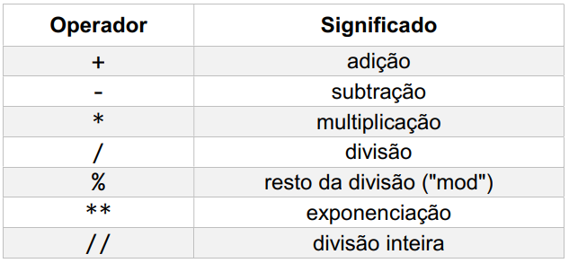

# algoritmos-python
Algoritmos utilizados e implmentados em sala de aula.

# Funcionalidades
Principais funcionalidades do uso do Python

## Operadores Aritmeticos

## Operadores Comparativos

## Operadores Lógicos

